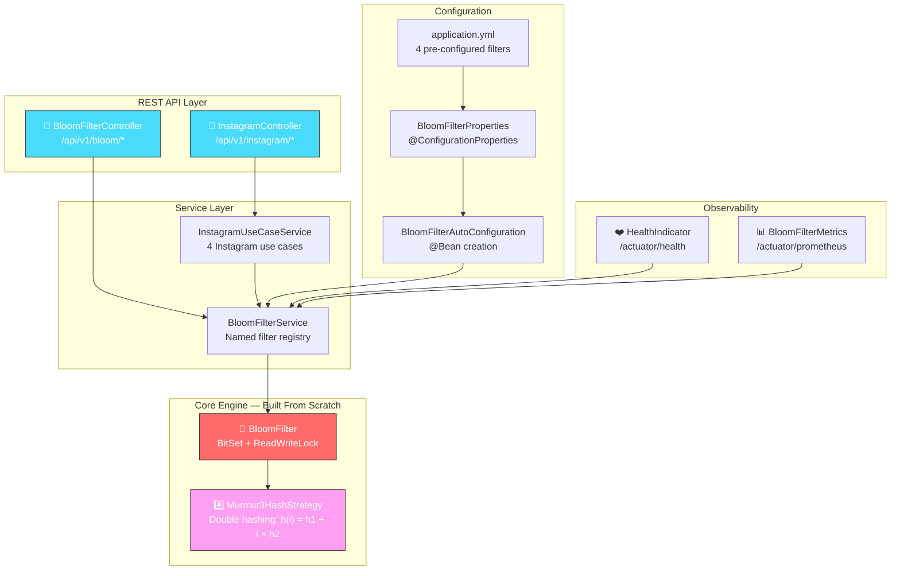
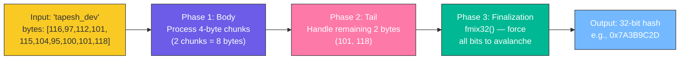
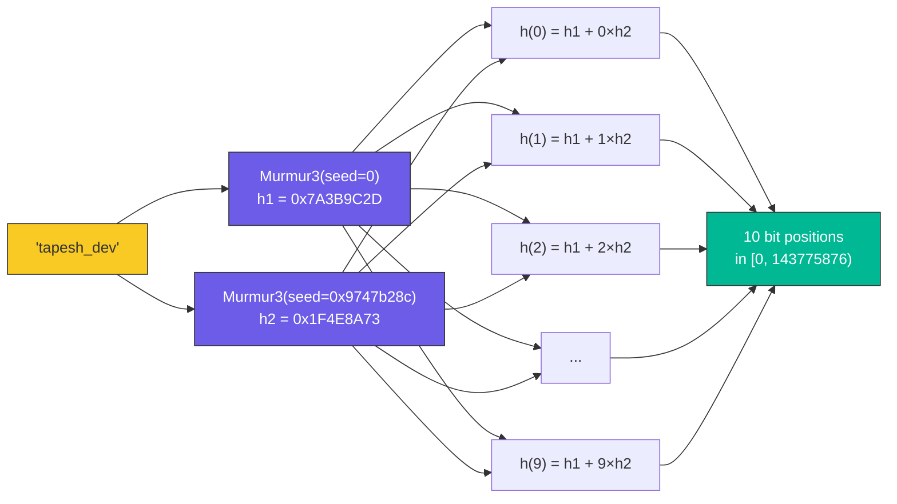
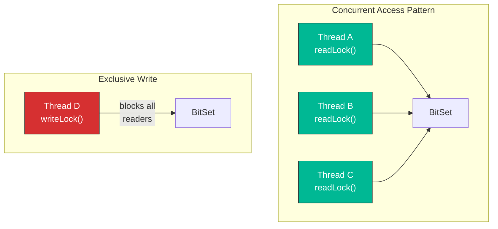
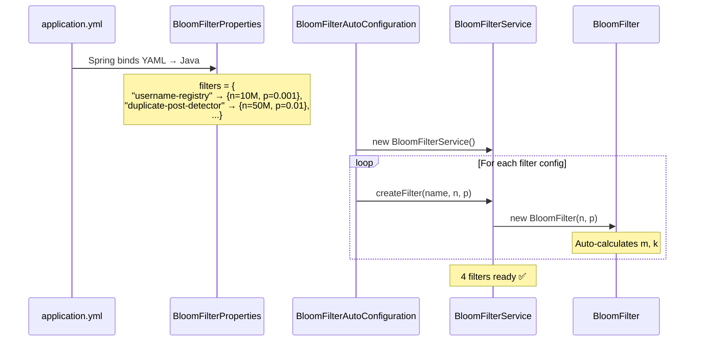
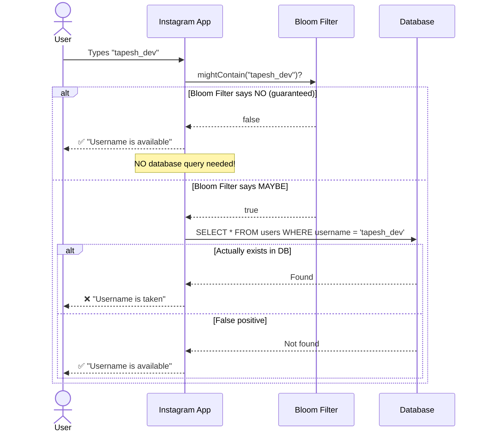
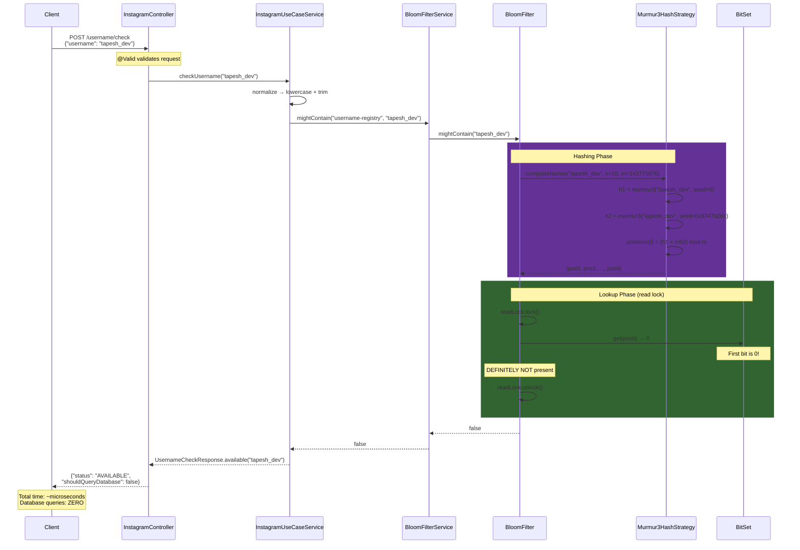

# 🌸 Production-Level Bloom Filter — Instagram-Like Application

> A complete, production-grade Bloom Filter built **entirely from scratch** in Java — no Guava, no Redis Bloom, no external libraries. Featuring Murmur3 hashing, 4 real-world Instagram use cases, REST APIs, and full observability.

[](https://openjdk.org/)
[](https://spring.io/projects/spring-boot)
[](/)
[](/)

---

## 📑 Table of Contents

- [What is a Bloom Filter?](#-what-is-a-bloom-filter)
- [Architecture Overview](#-architecture-overview)
- [Project Structure](#-project-structure)
- [The Math Behind It](#-the-math-behind-it)
- [Murmur3 Hash — From Scratch](#-murmur3-hash--from-scratch)
- [Core BloomFilter Class](#-core-bloomfilter-class)
- [Configuration Layer](#%EF%B8%8F-configuration-layer)
- [Service Layer](#-service-layer)
- [Instagram Use Cases](#-instagram-use-cases)
- [REST API Endpoints](#-rest-api-endpoints)
- [DTOs — Java Records](#-dtos--java-records)
- [Exception Handling](#-exception-handling)
- [Monitoring & Observability](#-monitoring--observability)
- [Request Flow — End to End](#-request-flow--end-to-end)
- [How to Run](#-how-to-run)
- [Test Results](#-test-results)

---

## 🌸 What is a Bloom Filter?

A Bloom Filter is a **space-efficient probabilistic data structure** that answers one question:

> **"Is this element in the set?"**

It gives two possible answers:

| Answer | Correctness |
|--------|------------|
| **"Definitely NOT in the set"** | ✅ 100% guaranteed correct (zero false negatives) |
| **"Probably in the set"** | ⚠️ Might be wrong with a small probability (false positive) |

### Why Not Just Use a HashSet?

| Feature | HashSet | Bloom Filter |
|---------|---------|-------------|
| Memory for 10M usernames | ~640 MB | ~17 MB |
| False negatives | None | None |
| False positives | None | ~0.1% (configurable) |
| Delete support | Yes | No |
| Time complexity | O(1) | O(k) where k = hash count |

At Instagram scale (2B+ users), this **40x memory saving** is critical.

### Visual Example

```
Bloom Filter bit array (simplified — 16 bits):

Initial state (empty):
Index:  0  1  2  3  4  5  6  7  8  9  10 11 12 13 14 15
Bits:  [0][0][0][0][0][0][0][0][0][0][ 0][ 0][ 0][ 0][ 0][ 0]

━━━━━━━━━━━━━━━━━━━━━━━━━━━━━━━━━━━━━━━━━━━━━━━━━━━━━━━━━━━━

Add "alice" → hash positions = {2, 5, 11}
Index:  0  1 [2] 3  4 [5] 6  7  8  9  10[11] 12 13 14 15
Bits:  [0][0][1][0][0][1][0][0][0][0][ 0][ 1][ 0][ 0][ 0][ 0]

━━━━━━━━━━━━━━━━━━━━━━━━━━━━━━━━━━━━━━━━━━━━━━━━━━━━━━━━━━━━

Add "bob" → hash positions = {1, 5, 14}
Index:  0 [1][2] 3  4 [5] 6  7  8  9  10[11] 12 13[14] 15
Bits:  [0][1][1][0][0][1][0][0][0][0][ 0][ 1][ 0][ 0][ 1][ 0]

━━━━━━━━━━━━━━━━━━━━━━━━━━━━━━━━━━━━━━━━━━━━━━━━━━━━━━━━━━━━

Check "alice" → positions {2, 5, 11} → ALL are 1 → "Probably YES" ✅
Check "carol" → positions {3, 7, 14} → pos 3 = 0  → "Definitely NO" ✅
Check "dave"  → positions {1, 2, 5}  → ALL are 1 → "Probably YES" ⚠️ FALSE POSITIVE!
```

> Dave was never added, but his hash positions overlap with bits set by "alice" and "bob". That's a false positive — and it happens with a known, **configurable** probability.

---

## 🏗 Architecture Overview



---

## 📂 Project Structure

```
bloomfilter/
├── pom.xml                                          # Maven config with dependencies
├── README.md                                        # ← You are here
└── src/
    ├── main/
    │   ├── java/com/bloomfilter/bloomfilter/
    │   │   ├── BloomfilterApplication.java          # Spring Boot entry point
    │   │   │
    │   │   ├── core/                                # 🧠 CORE — Built from scratch
    │   │   │   ├── BloomFilter.java                 # Bit array + optimal params + thread safety
    │   │   │   └── Murmur3HashStrategy.java         # Murmur3 hash + double hashing
    │   │   │
    │   │   ├── config/                              # ⚙️ CONFIGURATION
    │   │   │   ├── BloomFilterProperties.java       # YAML → Java binding
    │   │   │   └── BloomFilterAutoConfiguration.java# Auto-creates filters at startup
    │   │   │
    │   │   ├── service/                             # 📦 BUSINESS LOGIC
    │   │   │   ├── BloomFilterService.java          # Named filter registry (CRUD + stats)
    │   │   │   └── InstagramUseCaseService.java     # 4 Instagram use cases
    │   │   │
    │   │   ├── controller/                          # 🌐 REST API
    │   │   │   ├── BloomFilterController.java       # Generic Bloom Filter CRUD endpoints
    │   │   │   └── InstagramController.java         # Instagram-specific endpoints
    │   │   │
    │   │   ├── dto/                                 # 📋 DATA TRANSFER OBJECTS
    │   │   │   ├── BloomFilterRequest.java          # Generic add/check request
    │   │   │   ├── BloomFilterResponse.java         # Membership check response
    │   │   │   ├── BloomFilterStatsResponse.java    # Detailed filter statistics
    │   │   │   ├── CreateFilterRequest.java         # Dynamic filter creation
    │   │   │   ├── UsernameCheckRequest.java        # Username availability check
    │   │   │   ├── UsernameCheckResponse.java       #   └─ Response
    │   │   │   ├── DuplicatePostRequest.java        # Duplicate media detection
    │   │   │   ├── DuplicatePostResponse.java       #   └─ Response
    │   │   │   ├── NotificationDedupRequest.java    # Notification dedup
    │   │   │   ├── NotificationDedupResponse.java   #   └─ Response
    │   │   │   ├── FeedDedupRequest.java            # Feed dedup
    │   │   │   └── FeedDedupResponse.java           #   └─ Response
    │   │   │
    │   │   ├── exception/                           # ❌ ERROR HANDLING
    │   │   │   ├── BloomFilterException.java        # Base exception
    │   │   │   ├── FilterNotFoundException.java     # 404 — filter not found
    │   │   │   ├── FilterAlreadyExistsException.java# 409 — duplicate creation
    │   │   │   └── GlobalExceptionHandler.java      # @RestControllerAdvice
    │   │   │
    │   │   └── monitoring/                          # 📊 OBSERVABILITY
    │   │       ├── BloomFilterHealthIndicator.java   # Actuator health check
    │   │       └── BloomFilterMetrics.java           # Prometheus/Micrometer gauges
    │   │
    │   └── resources/
    │       └── application.yml                      # 4 pre-configured Instagram filters
    │
    └── test/java/com/bloomfilter/bloomfilter/
        ├── BloomfilterApplicationTests.java         # Context load test
        ├── core/
        │   ├── BloomFilterTest.java                 # 23 tests — core engine
        │   └── Murmur3HashStrategyTest.java         # 10 tests — hash algorithm
        └── service/
            ├── BloomFilterServiceTest.java          # 9 tests — service layer
            └── InstagramUseCaseServiceTest.java     # 11 tests — use case integration
```

---

## 🔢 The Math Behind It

### Two Key Parameters

Given:
- **n** = expected number of elements to insert
- **p** = desired false positive probability (e.g., 0.01 = 1%)

We calculate:

### Bit Array Size (m)

```
m = -(n × ln(p)) / (ln2)²
```

### Number of Hash Functions (k)

```
k = (m / n) × ln2
```

### Worked Example

For **10 million usernames** with **0.1% false positive rate**:

```
n = 10,000,000
p = 0.001

m = -(10,000,000 × ln(0.001)) / (0.6931)²
m = -(10,000,000 × (-6.9078)) / 0.4804
m = 69,078,000 / 0.4804
m ≈ 143,775,876 bits ≈ 17.14 MB     ← Compare to ~640 MB for HashSet!

k = (143,775,876 / 10,000,000) × 0.6931
k = 14.378 × 0.6931
k ≈ 10 hash functions
```

### In Code

```java
// BloomFilter.java

static int calculateOptimalBitSize(long n, double p) {
    return (int) Math.ceil(-(n * Math.log(p)) / (Math.log(2) * Math.log(2)));
}

static int calculateOptimalHashCount(int m, long n) {
    return Math.max(1, (int) Math.round((double) m / n * Math.log(2)));
}
```

These are called **once** in the constructor. After that, the filter knows exactly how many bits and hash functions it needs.

### Pre-Configured Filters

| Filter | Use Case | n (expected) | p (FPP) | m (bits) | k (hashes) | Memory |
|--------|----------|-------------|---------|----------|------------|--------|
| `username-registry` | Username check | 10M | 0.1% | 143.7M | 10 | 17.14 MB |
| `duplicate-post-detector` | Duplicate upload | 50M | 1% | 479.2M | 7 | 57.28 MB |
| `notification-dedup` | Notification spam | 5M | 1% | 47.9M | 7 | 5.73 MB |
| `feed-dedup` | Feed freshness | 100M | 1% | 958.5M | 7 | 114.56 MB |

---

## #️⃣ Murmur3 Hash — From Scratch

> **File:** [`Murmur3HashStrategy.java`](src/main/java/com/bloomfilter/bloomfilter/core/Murmur3HashStrategy.java)

### Why Murmur3?

| Hash Function | Speed | Distribution | Crypto-safe? | Use Case |
|--------------|-------|-------------|-------------|----------|
| MD5 | Slow | Good | Yes (overkill) | Security |
| SHA-256 | Slow | Excellent | Yes (overkill) | Security |
| Java `hashCode()` | Fast | **Poor** | No | General |
| **Murmur3** | **Very fast** | **Excellent** | No (not needed) | **Bloom Filters** |

For Bloom Filters we need **speed** and **uniform distribution**, not cryptographic security. Murmur3 is the industry standard.

### Algorithm — 3 Phases



#### Phase 1: Body — Process 4-byte Chunks

```java
while (i + 4 <= len) {
    // Read 4 bytes as a little-endian 32-bit integer
    int k = (data[i] & 0xFF)
            | ((data[i + 1] & 0xFF) << 8)     // Shift byte 2 left by 8 bits
            | ((data[i + 2] & 0xFF) << 16)    // Shift byte 3 left by 16 bits
            | ((data[i + 3] & 0xFF) << 24);   // Shift byte 4 left by 24 bits

    // Mix the chunk with magic constants
    k *= 0xcc9e2d51;              // Multiply by constant C1
    k = Integer.rotateLeft(k, 15); // Rotate bits left by 15 positions
    k *= 0x1b873593;              // Multiply by constant C2

    // Fold into the running hash
    h ^= k;                        // XOR with running hash
    h = Integer.rotateLeft(h, 13); // Rotate hash left by 13
    h = h * 5 + 0xe6546b64;       // Multiply and add constant

    i += 4;  // Move to next 4-byte chunk
}
```

**What's happening:**
1. Grab 4 bytes at a time, pack them into a 32-bit integer
2. Multiply by magic constants (chosen for optimal bit distribution)
3. Rotate bits (spreads changes across all bit positions)
4. XOR and fold into the running hash value

> **Why these constants?** Austin Appleby (the creator) tested millions of constant combinations and found `0xcc9e2d51` and `0x1b873593` produce the best avalanche effect.

#### Phase 2: Tail — Handle Remaining Bytes

If input length isn't divisible by 4, we have 1-3 leftover bytes:

```java
int remaining = 0;
switch (len - i) {
    case 3: remaining ^= (data[i + 2] & 0xFF) << 16;  // fall through ↓
    case 2: remaining ^= (data[i + 1] & 0xFF) << 8;   // fall through ↓
    case 1: remaining ^= (data[i] & 0xFF);
            remaining *= C1;
            remaining = Integer.rotateLeft(remaining, 15);
            remaining *= C2;
            h ^= remaining;
}
```

> **Fall-through:** `case 3` processes byte 3, then falls to `case 2` (byte 2), then `case 1` (byte 1). This handles all tail lengths elegantly in a single switch.

#### Phase 3: Finalization — Force Avalanche

```java
private static int fmix32(int h) {
    h ^= h >>> 16;     // XOR with right-shifted self
    h *= 0x85ebca6b;   // Multiply by magic constant
    h ^= h >>> 13;     // XOR shift again
    h *= 0xc2b2ae35;   // Another magic constant
    h ^= h >>> 16;     // Final XOR shift
    return h;
}
```

This ensures even inputs differing by 1 bit produce completely different hash outputs. Without this, similar inputs could produce similar hashes.

### Double Hashing — The Key Trick

Instead of computing k separate hash functions (expensive), we compute only **2 Murmur3 hashes** with different seeds and derive all k hashes mathematically:

```java
public int[] computeHashes(String element, int numHashes, int bitSize) {
    byte[] data = element.getBytes(StandardCharsets.UTF_8);

    int h1 = murmur3_32(data, 0);            // Hash with seed 0
    int h2 = murmur3_32(data, 0x9747b28c);   // Hash with different seed

    int[] hashes = new int[numHashes];
    for (int i = 0; i < numHashes; i++) {
        int combinedHash = h1 + (i * h2);    // h(i) = h1 + i × h2
        // Ensure positive value in [0, bitSize)
        hashes[i] = ((combinedHash % bitSize) + bitSize) % bitSize;
    }
    return hashes;
}
```



> **Why this works:** Kirsch & Mitzenmacher (2006) proved mathematically that `h(i) = h1 + i × h2` is as effective as k truly independent hash functions for Bloom Filters. We get **10 hash functions for the price of 2**.

---

## 🌸 Core BloomFilter Class

> **File:** [`BloomFilter.java`](src/main/java/com/bloomfilter/bloomfilter/core/BloomFilter.java)

### Constructor — Auto-Calculating Everything

```java
public BloomFilter(long expectedInsertions, double falsePositiveProbability) {
    validateParameters(expectedInsertions, falsePositiveProbability);

    this.expectedInsertions = expectedInsertions;
    this.falsePositiveProbability = falsePositiveProbability;
    this.bitSize = calculateOptimalBitSize(expectedInsertions, falsePositiveProbability);
    this.numHashFunctions = calculateOptimalHashCount(bitSize, expectedInsertions);
    this.bitSet = new BitSet(bitSize);           // Java's built-in bit array
    this.insertionCount = new AtomicLong(0);     // Thread-safe counter
    this.lock = new ReentrantReadWriteLock();     // Read-write lock
    this.hashStrategy = new Murmur3HashStrategy();
}
```

> Just say _"I expect 10M elements with 0.1% FPP"_ and the constructor figures out optimal m and k automatically.

### `add()` — Insert Element

```java
public void add(String element) {
    // Step 1: Compute k hash positions
    int[] hashes = hashStrategy.computeHashes(element, numHashFunctions, bitSize);

    // Step 2: Acquire exclusive write lock
    lock.writeLock().lock();
    try {
        // Step 3: Set each bit position to 1
        for (int hash : hashes) {
            bitSet.set(hash);
        }
    } finally {
        // Step 4: Always release lock (even on exception)
        lock.writeLock().unlock();
    }

    // Step 5: Increment counter (AtomicLong — no lock needed)
    insertionCount.incrementAndGet();
}
```

### `mightContain()` — The Lookup

```java
public boolean mightContain(String element) {
    int[] hashes = hashStrategy.computeHashes(element, numHashFunctions, bitSize);

    lock.readLock().lock();    // Shared read lock — multiple readers OK
    try {
        for (int hash : hashes) {
            if (!bitSet.get(hash)) {
                return false;  // ← Even ONE zero bit = DEFINITELY NOT present
            }
        }
    } finally {
        lock.readLock().unlock();
    }
    return true;               // ← All bits are 1 = PROBABLY present
}
```

> **The Key Insight:** If **ANY** of the k bit positions is `0`, the element was **never** added (guaranteed). If **ALL** are `1`, it *might* have been added, or those bits were set by other elements (false positive).

### Thread Safety — ReentrantReadWriteLock



| Operation | Lock Type | Multiple Threads? | Why? |
|-----------|-----------|-------------------|------|
| `mightContain()` | `readLock()` | ✅ Yes (concurrent) | Reads don't modify state |
| `add()` | `writeLock()` | ❌ No (exclusive) | Must not corrupt the bit array |

In Instagram's case, there are far more **reads** (checking usernames) than **writes** (registering usernames), so a read-write lock is dramatically more efficient than `synchronized`.

### Statistics Methods

```java
// Estimated FPP based on actual usage — increases as filter fills up
// Formula: (1 - e^(-k×n/m))^k
public double getEstimatedFalsePositiveProbability() {
    long n = insertionCount.get();
    return Math.pow(1.0 - Math.exp(-((double) numHashFunctions * n) / bitSize),
                    numHashFunctions);
}

// Saturation = what % of bits are set to 1?
public double getSaturationRatio() {
    return (double) bitSet.cardinality() / bitSize;
}
```

**Saturation vs. FPP Degradation:**

```
Saturation  10% → FPP ≈ 0.001%   (way under target)
Saturation  50% → FPP ≈ target    (working as designed)
Saturation  80% → FPP ≈ 5× target (degrading! ⚠️)
Saturation  95% → FPP ≈ 50%+      (filter is useless! 🔴)
```

---

## ⚙️ Configuration Layer

### YAML Configuration

> **File:** [`application.yml`](src/main/resources/application.yml)

```yaml
bloom:
  filters:
    username-registry:
      expected-insertions: 10000000       # 10M usernames
      false-positive-probability: 0.001   # 0.1% FPP

    duplicate-post-detector:
      expected-insertions: 50000000       # 50M uploads
      false-positive-probability: 0.01    # 1% FPP

    notification-dedup:
      expected-insertions: 5000000        # 5M events
      false-positive-probability: 0.01    # 1% FPP

    feed-dedup:
      expected-insertions: 100000000      # 100M user:post pairs
      false-positive-probability: 0.01    # 1% FPP
```

### Properties Binding

> **File:** [`BloomFilterProperties.java`](src/main/java/com/bloomfilter/bloomfilter/config/BloomFilterProperties.java)

```java
@ConfigurationProperties(prefix = "bloom")
public class BloomFilterProperties {
    private Map<String, FilterConfig> filters = new HashMap<>();
    //         ↑ key = "username-registry"
    //         ↑ value = FilterConfig{expectedInsertions=10000000, fpp=0.001}

    public static class FilterConfig {
        private long expectedInsertions = 1_000_000;   // default
        private double falsePositiveProbability = 0.01; // default
    }
}
```

Spring Boot automatically maps YAML keys → Java fields. Each filter name becomes a Map key.

### Auto-Configuration

> **File:** [`BloomFilterAutoConfiguration.java`](src/main/java/com/bloomfilter/bloomfilter/config/BloomFilterAutoConfiguration.java)

```java
@Configuration
@EnableConfigurationProperties(BloomFilterProperties.class)
public class BloomFilterAutoConfiguration {

    @Bean
    public BloomFilterService bloomFilterService(BloomFilterProperties properties) {
        BloomFilterService service = new BloomFilterService();
        properties.getFilters().forEach((name, config) -> {
            service.createFilter(name, config.getExpectedInsertions(),
                                 config.getFalsePositiveProbability());
        });
        return service;
    }
}
```



---

## 📦 Service Layer

### BloomFilterService — Named Filter Registry

> **File:** [`BloomFilterService.java`](src/main/java/com/bloomfilter/bloomfilter/service/BloomFilterService.java)

```java
// ConcurrentHashMap = thread-safe registry
private final Map<String, BloomFilter> filterRegistry = new ConcurrentHashMap<>();

// Create a new named filter
public BloomFilter createFilter(String name, long expectedInsertions, double fpp) {
    if (filterRegistry.containsKey(name)) {
        throw new FilterAlreadyExistsException(name);
    }
    BloomFilter filter = new BloomFilter(expectedInsertions, fpp);
    filterRegistry.put(name, filter);
    return filter;
}

// Delegate operations to named filters
public void add(String filterName, String element) {
    getFilter(filterName).add(element);  // getFilter() throws 404 if not found
}

public boolean mightContain(String filterName, String element) {
    return getFilter(filterName).mightContain(element);
}
```

The service doesn't know or care about use cases — it just manages filters by name.

---

## 📸 Instagram Use Cases

> **File:** [`InstagramUseCaseService.java`](src/main/java/com/bloomfilter/bloomfilter/service/InstagramUseCaseService.java)

### Use Case 1: Username Availability



```java
public UsernameCheckResponse checkUsername(String username) {
    String normalizedUsername = username.toLowerCase().trim();  // Case-insensitive!
    boolean mightExist = bloomFilterService.mightContain(USERNAME_FILTER, normalizedUsername);

    if (mightExist) {
        return UsernameCheckResponse.possiblyTaken(normalizedUsername);
        // → "Might be taken — verify with database"
    } else {
        return UsernameCheckResponse.available(normalizedUsername);
        // → "Definitely available — no DB query needed"
    }
}
```

> **Impact:** Reduces database load by **~99%** because most usernames being tried are unique.

---

### Use Case 2: Duplicate Post Detection

```java
public DuplicatePostResponse checkDuplicatePost(String mediaHash) {
    boolean mightExist = bloomFilterService.mightContain(DUPLICATE_POST_FILTER, mediaHash);

    if (mightExist) {
        return DuplicatePostResponse.possibleDuplicate(mediaHash);
        // → "Do a full byte-comparison before rejecting"
    } else {
        // Definitely new — register it immediately
        bloomFilterService.add(DUPLICATE_POST_FILTER, mediaHash);
        return DuplicatePostResponse.unique(mediaHash);
        // → "Safe to upload"
    }
}
```

> When we confirm a hash is new, we **immediately add it** to the filter. The next upload of the same image will be caught.

---

### Use Case 3: Notification Deduplication

```java
public NotificationDedupResponse checkNotificationDedup(String userId, String eventId) {
    String compositeKey = userId + ":" + eventId;  // "user123:like_event_456"
    boolean mightExist = bloomFilterService.mightContain(NOTIFICATION_FILTER, compositeKey);

    if (mightExist) {
        return NotificationDedupResponse.suppress(userId, eventId, compositeKey);
    } else {
        bloomFilterService.add(NOTIFICATION_FILTER, compositeKey);  // Mark as sent
        return NotificationDedupResponse.send(userId, eventId, compositeKey);
    }
}
```

> **Composite key** `userId:eventId` ensures User A getting "like_event_123" doesn't block User B from getting the same event. But User A won't get it **twice**.

---

### Use Case 4: Feed Deduplication

```java
// Step 1: Check during feed generation (read-only)
public FeedDedupResponse checkFeedDedup(String userId, String postId) {
    String compositeKey = userId + ":" + postId;
    boolean mightHaveSeen = bloomFilterService.mightContain(FEED_FILTER, compositeKey);

    if (mightHaveSeen) {
        return FeedDedupResponse.alreadySeen(userId, postId, compositeKey);
        // → Skip this post in the feed
    } else {
        return FeedDedupResponse.fresh(userId, postId, compositeKey);
        // → Show in feed
    }
}

// Step 2: Mark as seen after user scrolls past it (write)
public void markPostAsSeen(String userId, String postId) {
    bloomFilterService.add(FEED_FILTER, userId + ":" + postId);
}
```

> **Two-step process:** Check first, mark later. This prevents marking posts as "seen" before the user actually sees them.

---

## 🌐 REST API Endpoints

### Generic Bloom Filter API

| Method | Endpoint | Description |
|--------|----------|-------------|
| `POST` | `/api/v1/bloom/filters` | Create a new filter at runtime |
| `GET` | `/api/v1/bloom/filters` | List all registered filters |
| `DELETE` | `/api/v1/bloom/filters/{name}` | Delete a filter |
| `POST` | `/api/v1/bloom/{name}/add` | Add an element |
| `POST` | `/api/v1/bloom/{name}/check` | Check membership |
| `POST` | `/api/v1/bloom/{name}/reset` | Clear all bits |
| `GET` | `/api/v1/bloom/{name}/stats` | Get detailed statistics |

### Instagram-Specific API

| Method | Endpoint | Description |
|--------|----------|-------------|
| `POST` | `/api/v1/instagram/username/check` | Check username availability |
| `POST` | `/api/v1/instagram/username/register` | Register a username |
| `POST` | `/api/v1/instagram/post/duplicate-check` | Detect duplicate uploads |
| `POST` | `/api/v1/instagram/notification/dedup` | Deduplicate notifications |
| `POST` | `/api/v1/instagram/feed/check` | Check if user has seen a post |
| `POST` | `/api/v1/instagram/feed/mark-seen` | Mark a post as seen |

### Example Requests & Responses

#### Username Check
```bash
curl -X POST http://localhost:8080/api/v1/instagram/username/check \
  -H "Content-Type: application/json" \
  -d '{"username": "tapesh_dev"}'
```
```json
{
  "username": "tapesh_dev",
  "status": "AVAILABLE",
  "message": "Username 'tapesh_dev' is definitely available — no DB lookup needed",
  "shouldQueryDatabase": false
}
```

#### Duplicate Post Check
```bash
curl -X POST http://localhost:8080/api/v1/instagram/post/duplicate-check \
  -H "Content-Type: application/json" \
  -d '{"mediaHash": "sha256_abc123def456"}'
```
```json
{
  "mediaHash": "sha256_abc123def456",
  "status": "UNIQUE",
  "message": "Media is definitely new — safe to upload",
  "proceedWithUpload": true
}

```

#### Filter Statistics
```bash
curl http://localhost:8080/api/v1/bloom/username-registry/stats
```
```json
{
  "filterName": "username-registry",
  "expectedInsertions": 10000000,
  "actualInsertions": 1,
  "bitArraySize": 143775876,
  "numHashFunctions": 10,
  "bitsSet": 10,
  "configuredFpp": 0.001,
  "estimatedFpp": 0.0,
  "saturationPercent": 0.0,
  "memoryUsage": "17.14 MB",
  "healthStatus": "🟢 HEALTHY — filter is operating within optimal range"
}
```

---

## 📋 DTOs — Java Records

We use **Java Records** — immutable data carriers with auto-generated `equals()`, `hashCode()`, and `toString()`:

```java
public record UsernameCheckRequest(
    @NotBlank(message = "Username must not be blank")
    @Size(min = 3, max = 30, message = "Username must be between 3 and 30 characters")
    String username
) {}
```

Validation annotations work with `@Valid` in the controller. When validation fails, the `GlobalExceptionHandler` catches it and returns a structured error.

### Smart Factory Methods

```java
public record UsernameCheckResponse(
    String username, String status, String message, boolean shouldQueryDatabase
) {
    public static UsernameCheckResponse available(String username) {
        return new UsernameCheckResponse(username, "AVAILABLE",
            "Definitely available — no DB lookup needed", false);
    }
    public static UsernameCheckResponse possiblyTaken(String username) {
        return new UsernameCheckResponse(username, "POSSIBLY_TAKEN",
            "Might be taken — verify with database", true);
    }
}
```

Each response includes an **actionable boolean** (`shouldQueryDatabase`, `proceedWithUpload`, `shouldSendNotification`) that tells the caller exactly what to do next.

---

## ❌ Exception Handling

> **File:** [`GlobalExceptionHandler.java`](src/main/java/com/bloomfilter/bloomfilter/exception/GlobalExceptionHandler.java)

```java
@RestControllerAdvice   // Applies to ALL controllers globally
public class GlobalExceptionHandler {

    @ExceptionHandler(FilterNotFoundException.class)
    → 404: {"error": "Not Found", "message": "Bloom Filter not found: 'ghost'"}

    @ExceptionHandler(FilterAlreadyExistsException.class)
    → 409: {"error": "Conflict", "message": "Bloom Filter already exists: 'my-filter'"}

    @ExceptionHandler(MethodArgumentNotValidException.class)
    → 400: {"error": "Bad Request", "message": "username: must not be blank"}

    @ExceptionHandler(Exception.class)
    → 500: {"error": "Internal Server Error", "message": "An unexpected error occurred"}
}
```

**Exception Hierarchy:**

```
BloomFilterException (base)
├── FilterNotFoundException       → 404
└── FilterAlreadyExistsException  → 409
```

Every error returns the same structured JSON:

```json
{
    "timestamp": "2026-04-06T07:00:00Z",
    "status": 404,
    "error": "Not Found",
    "message": "Bloom Filter not found: 'ghost'"
}
```

---

## 📊 Monitoring & Observability

### Health Check

> **File:** [`BloomFilterHealthIndicator.java`](src/main/java/com/bloomfilter/bloomfilter/monitoring/BloomFilterHealthIndicator.java)

Accessible at `GET /actuator/health`:

```json
{
  "components": {
    "bloomFilter": {
      "status": "UP",
      "details": {
        "totalFilters": 4,
        "filter.username-registry.status": "HEALTHY",
        "filter.username-registry.saturation": "0.0%",
        "filter.username-registry.estimatedFpp": 0.0,
        "filter.username-registry.insertions": "1 / 10000000"
      }
    }
  }
}
```

| Saturation | Status | Action |
|------------|--------|--------|
| < 50% | 🟢 HEALTHY | All good |
| 50-80% | 🟡 WARNING | Monitor closely |
| > 80% | 🔴 CRITICAL | Reset or increase capacity |

### Prometheus Metrics

> **File:** [`BloomFilterMetrics.java`](src/main/java/com/bloomfilter/bloomfilter/monitoring/BloomFilterMetrics.java)

Accessible at `GET /actuator/prometheus`:

| Metric | Type | Description |
|--------|------|-------------|
| `bloom.filter.insertions` | Gauge | Elements inserted |
| `bloom.filter.saturation` | Gauge | Bit array fill ratio [0-1] |
| `bloom.filter.estimated.fpp` | Gauge | Current estimated FPP |
| `bloom.filter.bit.size` | Gauge | Total bit array size |

All metrics are tagged with `filter=<name>` for per-filter monitoring.

---

## 🔄 Request Flow — End to End

Here's the complete journey of a `POST /api/v1/instagram/username/check {"username": "tapesh_dev"}`:



---

## 🚀 How to Run

### Prerequisites
- Java 17+
- Maven (wrapper included)

### Run Tests
```bash
./mvnw clean test
```

### Start the Server
```bash
./mvnw spring-boot:run
```

Server starts at `http://localhost:8080`

### Quick Test
```bash
# Check a username
curl -X POST http://localhost:8080/api/v1/instagram/username/check \
  -H "Content-Type: application/json" \
  -d '{"username": "your_name"}'

# Health check
curl http://localhost:8080/actuator/health

# Filter statistics
curl http://localhost:8080/api/v1/bloom/username-registry/stats
```

---

## ✅ Test Results

**54 tests — ALL PASSED**

| Test Suite | Tests | What's Tested |
|-----------|-------|---------------|
| `BloomFilterTest` | 23 | Add/check, zero false negatives, FPP validation, thread safety, edge cases |
| `Murmur3HashStrategyTest` | 10 | Determinism, uniform distribution, avalanche effect, tail handling |
| `BloomFilterServiceTest` | 9 | Filter lifecycle, CRUD operations, statistics |
| `InstagramUseCaseServiceTest` | 11 | All 4 Instagram use cases, case sensitivity, per-user isolation |
| `BloomfilterApplicationTests` | 1 | Spring context loads |

### Key Test: False Positive Rate Validation

```
📊 FPP Test Results:
   Configured FPP: 0.01 (1%)
   Actual FPP:     0.0098 (0.98%)
   False positives: 983 / 100,000
```

The actual FPP matches the configured target — the math works! ✅

---

## 🧠 Key Technical Decisions

| Decision | What We Chose | Why |
|----------|--------------|-----|
| Hash Function | Murmur3 from scratch | Fast + excellent distribution, no library needed |
| Multiple Hashes | Double hashing `h(i) = h1 + i×h2` | k hashes from only 2 computations |
| DTOs | Java Records | Immutable, no Lombok, clean code |
| Thread Safety | ReentrantReadWriteLock | Concurrent reads, exclusive writes |
| Parameters | Auto-calculated from n & p | Zero manual tuning needed |
| Configuration | YAML + @ConfigurationProperties | Easy to change without recompiling |
| Monitoring | Actuator + Micrometer | Industry standard, Prometheus-ready |

---

<p align="center">
  Built with ❤️ from scratch — no Guava, no Redis Bloom, no external bloom filter libraries
</p>
